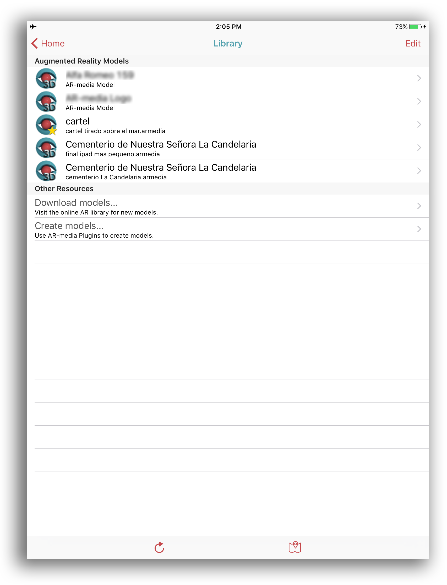

# Rationale

* This is a collateral project from another one: a virtual 3d reconstruction of a Patagonian cemetery. Once the goal was reached, it enable us to represent it in `augmented reality` mode. 
So, this is a minimal portion of the whole project.
* Check out a 3D model [here](https://sketchfab.com/models/7d09135c67064218bd6b673fa9d5f74c)
  

### What is this repository for? ###

* _Process-workflow-checklist_ turning a 2d object and virtually transform it to 3d augmented reality object.

### Procedures ###

* Download the [AR Maker](downloads/ARMaker.pdf) from our `Downloads` section. Then print it to A4 page size
 
* Download the [ARMedia player for IOS](https://itunes.apple.com/ar/app/armedia-player/id502524441?mt=8) or [ARMedia player for Android](https://play.google.com/store/apps/details?id=com.inglobetechnologies.armedia.player)
* Download the model supplied in the `Downloads` folder
* Open this file in ARMedia player. A notification will appear alerting you to a new model is in your library.

* Refresh your library. Set `cartel tirado sobre el mar.armedia` as the default model by clicking the `Star` option.

* Point your device to the `ARMaker.pdf` already printed and tap to augment!

* [Here](https://vimeo.com/273370855) can be seen all of these actions

Vide: https://vimeo.com/273370855

### Related repositories ###

* Some repositories linked with this project:
     - [Chapman documentary](https://bitbucket.org/imhicihu/chapman-documentary/src/)
     - [3D Cemetery (Photogrammetry)](https://bitbucket.org/imhicihu/3d-cemetery-photogrammetry/src/)

### Changelog ###

* Please check the [Commits](https://github.com/imhicihu/Augmented_Reality_Cemetery_experimental/commits/master) section for the current status

### Who do I talk to? ###

* Repo owner or admin
     - Contact `imhicihu` at `gmail` dot `com`

### Code of Conduct

* Please, check our [Code of Conduct](code_of_conduct.md)

### Legal ###

* All trademarks are the property of their respective owners.

### Copyright ###

This work is licensed under a [Creative Commons Attribution-ShareAlike 2.0 Generic License](http://creativecommons.org/licenses/by-sa/2.0/).
